# E3 Database Architecture

## Overview

E3 uses a normalized relational database design optimized for scalable content management and parallel processing. The system employs a single database per environment with WAL (Write-Ahead Logging) mode enabled for concurrent access.

## Database Configuration

### Environments
- **Alpha**: `database/alpha_e3_agent.db` 
- **Production**: `database/e3_agent.db`

### WAL Mode Settings
- **Journal Mode**: WAL (Write-Ahead Logging)
- **Cache Size**: 10MB (10,000 pages)
- **Synchronous**: NORMAL (balanced performance/safety)
- **Foreign Keys**: ENABLED
- **Auto Checkpoint**: 1000 pages

## Database Schema

### Entity Relationship Diagram

```mermaid
erDiagram
    TITLES {
        integer id PK "Auto-increment primary key"
        string book_id UK "Business identifier e.g., 'pg98', 'pg123'"
        string title "Book/Novel/Story name"
        string author "Author name"
        string genre "fiction, non-fiction, sci-fi, etc."
        string language "en, es, fr, etc."
        integer publication_year "Year published"
        string source_url "Project Gutenberg, etc."
        boolean audiobook_complete "Is audiobook done?"
        string audiobook_narrator_id FK "Default narrator"
        datetime created_at "Record creation time"
        datetime updated_at "Last modification time"
    }
    
    NARRATORS {
        string narrator_id PK "e.g., 'narrator_001'"
        string narrator_name "Display name"
        string voice_sample_path "Path to voice sample"
        string voice_model "eleven_labs, openai_tts, etc."
        string language "Primary language"
        string gender "male, female, neutral"
        string description "Voice style notes"
        boolean active "Is narrator available?"
        datetime created_at "Record creation time"
    }
    
    AUDIOBOOK_PRODUCTION {
        integer id PK "Auto-increment ID"
        string book_id FK "References titles.book_id"
        string narrator_id FK "References narrators.narrator_id"
        string status "pending, processing, completed, failed"
        string parse_novel_status "pending, processing, completed, failed"
        datetime parse_novel_completed_at "When parsing finished"
        string metadata_status "pending, processing, completed, failed"
        datetime metadata_completed_at "When metadata extraction finished"
        integer total_chapters "Number of chapters parsed"
        integer total_chunks "Number of text chunks"
        integer total_words "Total word count"
        string audio_generation_status "pending, processing, completed, failed"
        datetime audio_generation_completed_at "When audio generation finished"
        integer audio_jobs_completed "Number of TTS jobs completed"
        integer total_audio_files "Total audio files generated"
        integer audio_duration_seconds "Total audio duration"
        integer audio_file_size_bytes "Total audio file size"
        string audio_files_moved_status "pending, processing, completed, failed"
        datetime audio_files_moved_completed_at "When files moved to final location"
        string audio_combination_planned_status "pending, processing, completed, failed"
        datetime audio_combination_planned_completed_at "When combination planned"
        string audio_combination_status "pending, processing, completed, failed"
        datetime audio_combination_completed_at "When final audio combined"
        string image_prompts_status "pending, processing, completed, failed"
        datetime image_prompts_started_at "When image prompt generation started"
        datetime image_prompts_completed_at "When image prompts finished"
        string image_jobs_generation_status "pending, processing, completed, failed"
        datetime image_jobs_generation_completed_at "When image jobs created"
        integer image_jobs_completed "Number of image generation jobs completed"
        integer total_image_jobs "Total image jobs created"
        string image_generation_status "pending, processing, completed, failed"
        datetime image_generation_completed_at "When image generation finished"
        string subtitle_generation_status "pending, processing, completed, failed"
        datetime subtitle_generation_completed_at "When subtitles finished"
        string video_generation_status "pending, processing, completed, failed"
        datetime video_generation_started_at "When video generation started"
        datetime video_generation_completed_at "When video generation finished"
        integer total_videos_created "Number of videos created"
        text metadata "JSON metadata for processing details"
        integer retry_count "Number of retry attempts"
        integer max_retries "Maximum retry attempts allowed"
        datetime created_at "Record creation time"
        datetime updated_at "Last modification time"
    }
    
    COMFYUI_JOBS {
        integer id PK "Auto-increment ID"
        string config_name "YAML config filename"
        string job_type "image, speech, video, etc."
        string workflow_id "ComfyUI workflow identifier"
        integer priority "Job priority (lower = higher priority)"
        string status "pending, processing, done, failed"
        integer run_count "Number of execution attempts"
        integer retries_attempted "Current retry count"
        integer retry_limit "Maximum retries allowed"
        datetime start_time "Job execution start time"
        datetime end_time "Job execution end time"
        real duration "Execution duration in seconds"
        text error_trace "Error details if failed"
        text metadata "JSON job metadata"
        string worker_id "Worker processing this job"
        datetime lease_expires_at "Job lease expiration time"
    }

    TITLES ||--o{ AUDIOBOOK_PRODUCTION : "book_id"
    NARRATORS ||--o{ AUDIOBOOK_PRODUCTION : "narrator_id"
    TITLES }o--|| NARRATORS : "audiobook_narrator_id"
```



### Table Descriptions

#### TITLES (Master Content Catalog)
The central catalog of all books/content in the system. Each book gets a unique `book_id` (typically Project Gutenberg ID) and serves as the single source of truth for content metadata.

**Key Features:**
- Primary key: `book_id` (string, e.g., 'pg98')
- Netflix-style content catalog design
- Tracks audiobook completion status
- Links to default narrator for audiobook production

#### NARRATORS (Voice Talent Profiles)
Manages voice talent profiles and their associated voice samples and settings.

**Key Features:**
- Primary key: `narrator_id` (string, e.g., 'narrator_001')
- Supports multiple voice models (ElevenLabs, OpenAI TTS, etc.)
- Language and gender classification for voice matching
- Active/inactive status for narrator availability

#### AUDIOBOOK_PRODUCTION (Workflow Status Tracking)
Tracks the detailed workflow status for audiobook production. Each record represents one book being processed by one narrator.

**Key Features:**
- Workflow-ordered columns following audiobook production pipeline
- Detailed status tracking for each production step
- Metrics tracking (duration, file counts, etc.)
- Retry logic with configurable limits
- JSON metadata for flexible data storage

#### COMFYUI_JOBS (Job Queue Management)
Manages the ComfyUI job queue for image, video, and other AI generation tasks.

**Key Features:**
- Priority-based job scheduling
- Job leasing with expiration for distributed processing
- Comprehensive retry logic
- Worker assignment tracking
- Performance metrics (duration, run counts)

### Database Relationships

1. **TITLES → AUDIOBOOK_PRODUCTION** (1:N)
   - One book can have multiple audiobook productions (different narrators)
   - Foreign key: `audiobook_production.book_id → titles.book_id`

2. **NARRATORS → AUDIOBOOK_PRODUCTION** (1:N)
   - One narrator can work on multiple books
   - Foreign key: `audiobook_production.narrator_id → narrators.narrator_id`

3. **TITLES → NARRATORS** (N:1, Optional)
   - Each book can have a default narrator
   - Foreign key: `titles.audiobook_narrator_id → narrators.narrator_id`

### Indexes for Performance

#### TITLES Table
- `PRIMARY KEY (book_id)`
- `INDEX idx_titles_audiobook_complete (audiobook_complete)`
- `INDEX idx_titles_genre (genre)`
- `INDEX idx_titles_author (author)`

#### NARRATORS Table
- `PRIMARY KEY (narrator_id)`
- `INDEX idx_narrators_active (active)`
- `INDEX idx_narrators_language (language)`

#### AUDIOBOOK_PRODUCTION Table
- `PRIMARY KEY (id)`
- `INDEX idx_audiobook_book_id (book_id)`
- `INDEX idx_audiobook_narrator_id (narrator_id)`
- `INDEX idx_audiobook_status (status)`
- `INDEX idx_audiobook_workflow_status (parse_novel_status, audio_generation_status, video_generation_status)`
- `INDEX idx_audiobook_created (created_at)`

#### COMFYUI_JOBS Table
- `PRIMARY KEY (id)`
- `UNIQUE INDEX idx_comfyui_config_name (config_name)`
- `INDEX idx_comfyui_status_priority (status, priority)`
- `INDEX idx_comfyui_started (start_time)`

## Content Management Philosophy

### Book-Centric Architecture
The system uses a **book-centric approach** where each piece of content (book) serves as the organizational unit:

```
foundry/
├── pg98/                    # Project Gutenberg book 98
│   ├── input.html          # Original source file
│   ├── audiobook/          # All audiobook-related files
│   │   ├── metadata.json   # Parsing results
│   │   ├── audio_chunks/   # Individual TTS files
│   │   ├── combined/       # Final combined audio
│   │   └── subtitles/      # Subtitle files
│   ├── images/             # Book illustrations, covers
│   ├── videos/             # Video adaptations
│   └── metadata.json       # Book-level metadata
└── pg123/                  # Another book
```

### Benefits of This Architecture

1. **Scalability**: Easy to add new content types (movies, podcasts, games)
2. **Organization**: All assets for one book in one location
3. **Backup/Restore**: Simple per-book operations
4. **Parallel Processing**: WAL mode enables concurrent access
5. **Professional**: Netflix-style content management system
6. **Extensible**: Normalized design supports complex queries and relationships

## Query Examples

### Find all incomplete audiobooks
```sql
SELECT t.book_id, t.title, t.author 
FROM titles t 
WHERE t.audiobook_complete = false;
```

### Get audiobook production status for a book
```sql
SELECT t.title, n.narrator_name, ap.status, ap.audio_generation_status
FROM titles t
JOIN audiobook_production ap ON t.book_id = ap.book_id
JOIN narrators n ON ap.narrator_id = n.narrator_id
WHERE t.book_id = 'pg98';
```

### Find active narrators by language
```sql
SELECT narrator_id, narrator_name, voice_model
FROM narrators 
WHERE active = true AND language = 'en'
ORDER BY narrator_name;
```

### Get ComfyUI job queue status
```sql
SELECT job_type, status, COUNT(*) as count
FROM comfyui_jobs 
GROUP BY job_type, status
ORDER BY job_type, status;
```

This architecture provides a solid foundation for building a scalable, professional content management and processing system.